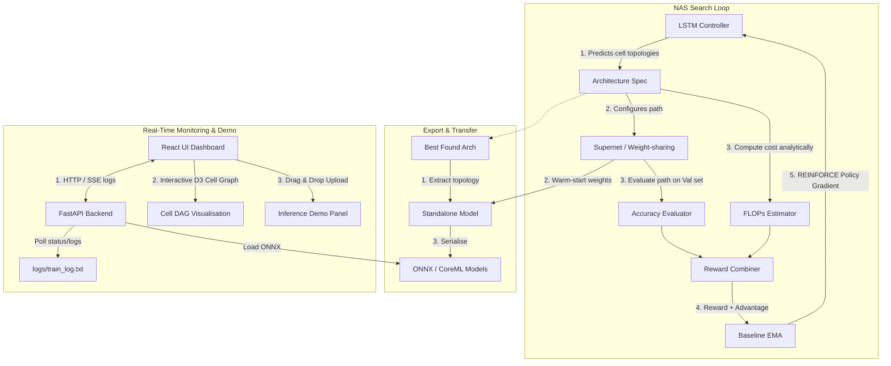

# NeuroSearch 🧠🔍

NeuroSearch is a modern, end-to-end **Neural Architecture Search (NAS)** framework powered by **Reinforcement Learning** (RL) built in PyTorch. It automates the discovery of high-performance, resource-efficient neural network architectures for computer vision (CIFAR-10).

The system uses a **weight-sharing Supernet** search space to avoid training candidate networks from scratch. An **LSTM Controller** (the RL agent) learns to compose cell DAG topologies by maximizing a joint reward function combining validation accuracy and computational cost (FLOPs). 

It features a **real-time React + FastAPI frontend dashboard** that lets you monitor the search, visualize cell DAGs with D3.js, and run live inference on the exported ONNX model.

---

## 🔄 Pipeline Workflow & Architecture Diagram

Below is the conceptual layout of how the Reinforcement Learning agent (LSTM Controller) searches the cell DAG space using the weight-shared Supernet, combined with the real-time FastAPI + React dashboard:



## 🏛️ Project Architecture

```
nas_rl/
├── controller/          # Reinforcement Learning Controller
│   ├── lstm_controller.py   # RNN policy network predicting topologies
│   └── baseline.py          # Exponential moving average baseline (variance reduction)
├── search_space/        # Weight-Sharing Search Space
│   ├── ops.py               # Predefined candidates (conv, sepconv, skip, pooling)
│   ├── cell.py              # Directed Acyclic Graph (DAG) cell layout
│   └── supernet.py          # Complete weight-sharing network wrapper
├── reward/              # Multi-objective Rewards
│   ├── cost_estimator.py    # Analytical FLOPs calculation
│   └── reward_combiner.py   # Accuracy + FLOPs reward formulation
├── trainer/             # Training & Evaluation Loops
│   ├── supernet_trainer.py  # Path sampling & Supernet pretraining
│   └── evaluator.py         # Warm-start standalone model evaluator
├── export/              # Export & Deployment
│   ├── model_builder.py     # Standalone model wrapper & Weight transfer logic
│   └── exporter.py          # ONNX and CoreML export wrappers
├── search/              # NAS Loop Orchestration
│   └── search_loop.py       # Controller updates & search management
├── data.py              # CIFAR-10 data loaders
└── train.py             # Main pipeline entrypoint (pretrain -> search -> export)

backend/                 # FastAPI Dashboard Backend
├── main.py              # API routes & live log streamer (SSE)
├── log_parser.py        # Structured log parser (train_log.txt)
└── inference.py         # ONNX runtime inference loader

frontend/                # React Vite Dashboard Frontend
├── src/
│   ├── App.jsx          # App layout & Tab routing
│   ├── api.js           # Centralised Axios API client
│   ├── components/      # Reusable UI widgets (StatCard, ConfidenceBar, etc.)
│   └── tabs/
│       ├── SearchMonitor.jsx      # Stat cards & 4 live Recharts charts
│       ├── ArchitectureViewer.jsx # Leaderboard & D3-based Cell DAG Visualiser
│       └── InferenceDemo.jsx      # Interactive Image Uploader & Tester
```

---

## 🚀 Getting Started

### 1. Installation

Clone the repository and install the backend and frontend dependencies:

```bash
# Install backend dependencies
pip install torch torchvision torchaudio fastapi uvicorn onnxruntime pillow numpy python-multipart

# Install frontend dependencies
cd frontend
npm install
```

### 2. Running the NAS Pipeline

The training pipeline runs in three phases:
1. **Pretraining**: Train the Supernet using path sampling on CIFAR-10.
2. **Search**: Update the LSTM controller using REINFORCE policy gradients to find optimal architectures.
3. **Export & Transfer**: Extract the best architecture, transfer weights from the Supernet, and export to ONNX/CoreML.

Run the pipeline:

```bash
# Run a quick smoke test (1 epoch pretrain, 5 search episodes)
python3 -m nas_rl.train --smoke

# Run the full pipeline (50 epochs pretrain, 200 search episodes)
python3 -m nas_rl.train
```

---

## 🖥️ Running the Dashboard

You can monitor the active training run or inspect the final found models in the interactive dashboard.

### Run both servers concurrently:
```bash
# Using concurrently (configured in package.json/start.sh)
bash start.sh
```

Or start them separately:

```bash
# Terminal 1: FastAPI Backend (Port 8000)
python3 -m uvicorn backend.main:app --reload --port 8000

# Terminal 2: Vite React Frontend (Port 5173)
cd frontend
npm run dev
```

Open **http://localhost:5173** to view the dashboard.

---

## 📊 Dashboard Key Features

### 1. Search Monitor
* **Summary Stats**: Live metrics including episodes completed, best validation accuracy, lowest FLOPs, and number of unique architectures searched.
* **Reward & Entropy Curves**: Real-time tracking of the controller's learning progress and model convergence (flagging entropy collapse).
* **Pareto Frontier Scatter Plot**: Accuracy vs. FLOPs visualization highlighting the top architectures.
* **FLOPs Histogram**: Distribution of architecture complexity color-coded by average validation accuracy.

### 2. Architecture Viewer
* **Leaderboard**: Displays the top-5 models ranked by joint reward.
* **D3 Cell DAG Visualizer**: Interactive node-link diagram showing the computational routing within the normal cells. Edges are colored by op type (e.g., green for skip-connections, blue for convolutions).
* **Op Distribution Chart**: Visualizes the proportion of operations chosen across the selected cell structure.

### 3. Inference Demo
* **Drag and Drop Uploader**: Drag and drop your own image (`PNG`, `JPG`, `JPEG`) to test model predictions.
* **CIFAR-10 Class Sample Picker**: Click a class preset to instantly load and test standard test images.
* **Latency Profiler**: Displays real-time CPU/GPU execution speed of the exported standalone ONNX model.

---

## 🚦 Unit Testing

We maintain full coverage of all critical pipeline components. Run tests before committing:

```bash
# Run all unit tests
python3 -m unittest discover -s nas_rl -p "test_*.py"
```

Individual test files:
- `nas_rl/search_space/test_ops.py`: Dimension checking for operations.
- `nas_rl/search_space/test_cell_supernet.py`: DAG cell connections and Supernet forward pass.
- `nas_rl/controller/test_controller.py`: LSTM controller policy gradient sampling.
- `nas_rl/reward/test_reward.py`: FLOP estimation and reward weighting.
- `nas_rl/search/test_search.py`: Core search iteration validation.
- `nas_rl/export/test_export.py`: Standalone model builder and weight transfer logic.

---

## 🛠️ Tech Stack

* **Deep Learning**: PyTorch, Torchvision
* **Export Format**: ONNX, Apple CoreML (`coremltools`)
* **API Backend**: FastAPI, Uvicorn, ONNX Runtime (Python)
* **Frontend**: React 18, Vite, Recharts, D3.js, Lucide Icons, Axios
